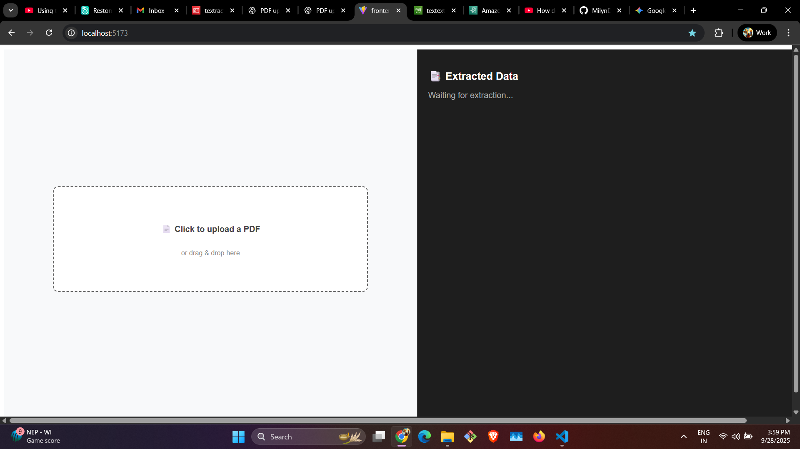
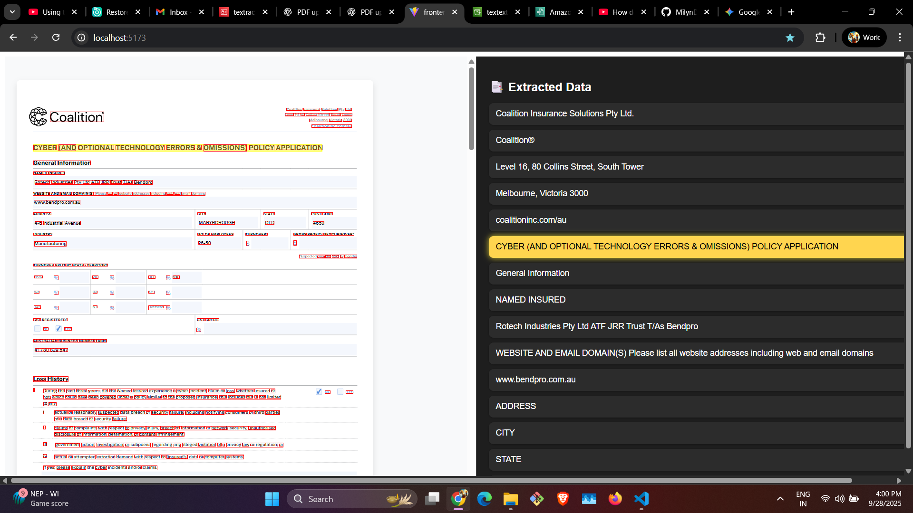

# aws-textract-content-highlighter

A web application for highlighting text within PDFs, powered by a full-stack JavaScript architecture.

This project uses AWS Textract to perform intelligent Optical Character Recognition (OCR) and extract bounding box coordinates from PDF documents. These documents are stored and retrieved with low latency using Amazon S3 Express One Zone, a high-performance storage class.

The front-end is built with React and Vite, while the back-end is a lightweight Express.js server.

---

## Features

- Upload PDF documents
- Extract text, tables, and forms with AWS Textract
- View JSON output alongside the PDF
- Highlight text in the PDF when selecting extracted JSON items
- Store and retrieve files from Amazon S3 Express One Zone

---

## Screenshots

### Main Application View



### Text Selection and Highlighting



---

## Getting Started

Follow these instructions to set up the project locally.

### Prerequisites

You’ll need the following installed on your machine:

- [Node.js & npm](https://nodejs.org/)
- [AWS CLI](https://aws.amazon.com/cli/) configured with credentials that have access to Amazon Textract and Amazon S3 Express One Zone

---

### Installation

1. Clone the repository

   ```bash
   git clone https://github.com/MilynDsilva/aws-textract-content-highlighter.git
   ```

2. Navigate to the project directory

   ```bash
   cd aws-textract-content-highlighter
   ```

3. Install dependencies

   ```bash
   npm install
   ```

   This will install both the client and server dependencies.

---

### Running the Application

This project has two parts: front-end (Vite) and back-end (Express.js). Run them in separate terminals.

#### 1. Start the Front-End

```bash
npm run dev
```

- Runs the Vite dev server
- Available at: http://localhost:5173

#### 2. Start the Back-End

```bash
nodemon index.js
```

- Runs the Express.js server
- Available at: http://localhost:5000

---

## Environment Variables

Create a `.env` file in the `backend` directory:

```env
AWS_ACCESS_KEY_ID=your-access-key-id
AWS_SECRET_ACCESS_KEY=your-secret-access-key
AWS_REGION=ap-south-1
S3_BUCKET=your-bucket-name
```

Do not commit this file to GitHub. Add `.env` to your `.gitignore`.

---

## Project Structure

```
aws-textract-content-highlighter/
├── backend/
│   ├── index.js         # Express server
│   ├── .env             # AWS credentials & config
│   └── uploads/         # Temp storage for uploads
├── frontend/
│   ├── src/             # React components
│   ├── public/          # Static assets
│   └── vite.config.js   # Vite configuration
├── screenshots/         # App screenshots for README
├── package.json
└── README.md
```

---

## License

This project is licensed under the MIT License.
